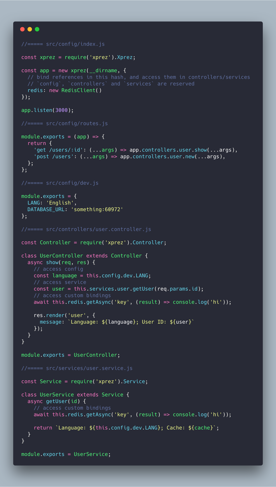

# Xprez

  [](https://codeclimate.com/github/yzhan1/xprez/maintainability) 

A minimal opinionated web framework (built on top of [Express.js](https://github.com/expressjs/express/)) that separates router, controllers and services. Full documentation and CLI generator will be available soon.

Heavily inspired by [Egg.js](https://github.com/eggjs/egg).

### Getting Started

+ To install, run `npm i xprez --save`
+ To run the example,
    1. Either
        + Clone the repo, `cd example`
        + Or download the `./example` folder, change all `from '../../..'` to `from 'xprez'`
    2. Then run `npm install` and `xprez s`
+ To contribute, please first clone the repo, then run `npm install`

#### Executable Bin

By default, apps need to be run with `xprez serve`. The command-line runner will have a scaffolding option available soon.

### Example Code Snippet

Sample directory is located in `./example`. 



### Required Folder Structure

To start app, run `xprez s` or `xprez serve` in the root directory of your project. Notice that you need to strictly follow
this structure in order to make your app executable. You can run `xprez -h` to see all the available options.

```
.
├── package-lock.json
├── package.json
└── src
    ├── config
        ├── dev.js
        ├── prod.js
        ├── index.js      ------> App's entry point
        └── routes.js  
    ├── controllers
        └── user.controller.js
    ├── services
        └── user.service.js
    └── views
        └── user.ejs
```